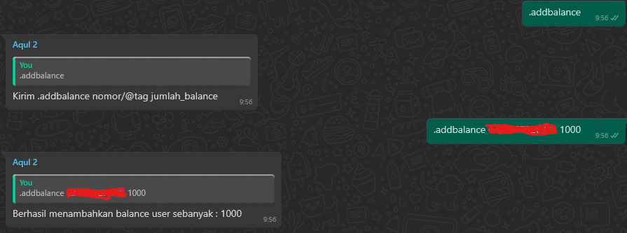

# Add Balance

Command ini berfungsi untuk menambahkan [balance](../../category/balance) user.

|                       Info                        |      |
| :-----------------------------------------------: | :--: |
| 
Only Nitro
 |  ❌  |
|                Menggunakan Prefix                 |  ✅  |
|                 Menggunakan limit                 |  ❌  |
|                    Hanya Owner                    |  ✅  |
|                   Hanya Premium                   |  ❌  |
|                    Hanya Group                    |  ❌  |
|                 Hanya Admin Group                 |  ❌  |
|                Hanya Private Chat                 |  ❌  |
|                       Limit                       |  1   |
|                     Cooldown                      | 5000 |
|                       Level                       |  0   |

## Command

### #addbalance

Penggunaan dapat dilakukan dengan cara mengirim `#addbalance nomor jumlah_balance` atau `#addbalance @mention jumlah_balance`.

Contoh penggunaan:

- #addbalance 628xxxxx 1000.
- #addbalance @mentions 1000.

## Failed Command

Beberapa penyebab terjadinya error:

- Format inputan nomor tidak internasional, `628xx` bukan `08xx`.
- Jumlah balance negatif atau nol.
- Nomor tujuan blum terdaftar menjadi user.
- Inputan nomor mengandung karakter selain nomor.

