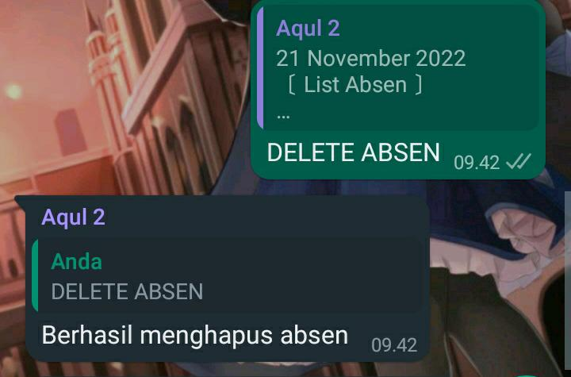

# Absen

Fitur ini berfungsi untuk membuat absen dan mendata peserta group.

|                       Info                        |      |
| :-----------------------------------------------: | :--: |
| 
Only Nitro
 |  ❌  |
|                Menggunakan Prefix                 |  ✅  |
|                 Menggunakan limit                 |  ❌  |
|                    Hanya Owner                    |  ❌  |
|                   Hanya Premium                   |  ❌  |
|                    Hanya Group                    |  ✅  |
|                 Hanya Admin Group                 |  ❌  |
|                Hanya Private Chat                 |  ❌  |
|                       Limit                       |  1   |
|                     Cooldown                      | 5000 |
|                       Level                       |  0   |

## Command

### #mulaiabsen

Mulai absen berfungsi untuk membuat absen. Fitur ini hanya bisa digunakan oleh **Admin Group**.

### #absen

Command ini berfungsi untuk absen.

### #cekabsen

Command ini berfungsi untuk mengecek absensi.

### #deleteabsen

Command ini berfungsi untuk menghapus absen.

