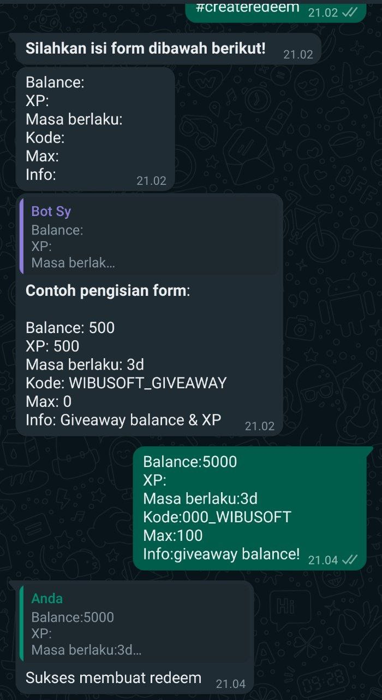

# Create Redeem

Berfungsi untuk membuat redeem.

|                       Info                        |      |
| :-----------------------------------------------: | :--: |
| <div class="label license nitro">Only Nitro</div> |  ❌  |
|                Menggunakan Prefix                 |  ✅  |
|                 Menggunakan limit                 |  ❌  |
|                    Hanya Owner                    |  ✅  |
|                   Hanya Premium                   |  ❌  |
|                    Hanya Group                    |  ❌  |
|                 Hanya Admin Group                 |  ❌  |
|                Hanya Private Chat                 |  ❌  |
|                       Limit                       |  1   |
|                     Cooldown                      | 5000 |
|                       Level                       |  0   |

## Command

### #createredeem

Saat mengirim `#createredeem` bot akan mengirim formulir yang harus anda isi seperti berikut.

```
Balance:
XP:
Masa berlaku:
Kode:
Max:
Info:
```

- `Balance` dapat diisi dengan angka, atau boleh saja dikosongkan.
- `XP` dapat diisi dengan angka, atau boleh saja dikosongkan.
- `Masa Berlaku` dapat diisi dengan `3d`, dimana d berarti days.
- `Kode` adalah kode redeem, bersifat optional.
- `Max` limit user yang dapat melakukan redeem.
- `Info` Info mengenai redeem, bersifat optional.


